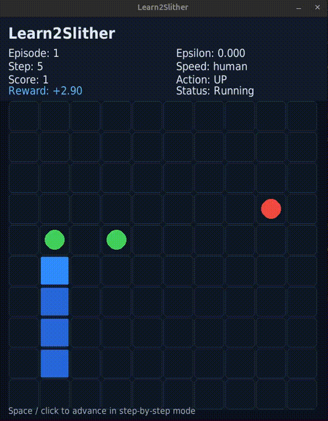

<div align="center">


</div>

# Learn2Slither 🐍

A modular reinforcement learning implementation of the classic Snake game with a high-performance Q-learning agent trained to achieve 40+ score consistently.

<div align="center">



*The trained agent playing with heuristic-guided exploration enabled, achieving consistent high scores.*

</div>

## Features

**Agent Capabilities:**
- Q-learning with tabular state representation (625 discretized states)
- Intelligent state encoding with distance bands and relative positioning
- Epsilon-greedy exploration strategy with configurable decay
- Heuristic-guided mode for faster learning
- Model persistence with JSON serialization

**Game Mechanics:**
- Fixed 10x10 board (configurable board size via CLI)
- Two green apples (+150 reward) and one red apple (-60 reward)
- Dynamic snake growth on green apple consumption
- Step-based reward system with progress tracking
- Game-over conditions: wall collision, self-collision, timeout

**Interface & Visualization:**
- Real-time Pygame rendering with dark blue theme
- Episode statistics panel with learning metrics
- Step-by-step mode for detailed analysis
- Speed presets: slow, human, normal, fast
- Headless training mode for acceleration

## Technical Stack

- **Language:** Python 3.12+
- **Dependencies:** Pygame 2.5+, NumPy 1.26+
- **ML Framework:** Pure Python (no external ML libraries)
- **Board:** Configurable 10x10 to 20x20+ (default: 10x10)

## Quick Start

### Installation

```bash
python3 -m pip install -r requirements.txt
```

### Training from Scratch

```bash
./snake -s 100000 -v off -q -hr -S models/qtable_trained.json
```

### Evaluating a Pre-trained Model

```bash
./snake -l models/qtable_150k_final.json -s 10 -d -v on -sp human
```

### Testing on Larger Board

```bash
./snake -l models/qtable_150k_final.json -s 5 -d -v on -b 20
```

## Usage Examples

Train 1000 episodes with visualization:
```bash
./snake -s 1000 -v on -sp human
```

Fast headless training:
```bash
./snake -s 5000 -v off -q
```

Step-by-step mode for debugging:
```bash
./snake -s 1 -st -v on -sp human
```

## CLI Arguments

| Argument | Short | Type | Default | Description |
|----------|-------|------|---------|-------------|
| `--sessions` | `-s` | int | 1 | Number of training episodes |
| `--visual` | `-v` | on/off | off | Enable/disable graphical rendering |
| `--speed` | `-sp` | str | human | Render speed: slow, human, normal, fast, or ms |
| `--step-by-step` | `-st` | flag | — | Enable step-by-step mode |
| `--load` | `-l` | path | — | Load pre-trained model |
| `--save` | `-S` | path | — | Save trained model |
| `--dontlearn` | `-d` | flag | — | Evaluate without learning |
| `--epsilon` | `-e` | float | — | Override exploration rate |
| `--heuristics` | `-hr` | flag | — | Enable heuristic-guided mode |
| `--board-size` | `-b` | int | 10 | Set board dimensions (NxN) |
| `--learning-rate` | `-lr` | float | — | Override Q-learning rate |
| `--discount-factor` | `-df` | float | — | Override discount factor |
| `--epsilon-min` | `-em` | float | — | Override minimum exploration rate |
| `--epsilon-decay` | `-ed` | float | — | Override exploration decay |
| `--no-render` | `-nr` | flag | — | Disable pygame rendering |
| `--quiet` | `-q` | flag | — | Minimize terminal output |

## Model Files

Pre-trained models are included:
- `qtable_150k_final.json` - Best model (150k episodes, score: 43)
- `qtable_100k_optimized.json` - Optimized variant (100k episodes)
- `qtable_10k.json` - Quick baseline (10k episodes)

Models use JSON format with complete Q-table, configuration, and hyperparameters.

## Performance

| Model | Episodes | Best Score | Avg Score | Win Rate (≥10) |
|-------|----------|------------|-----------|----------------|
| qtable_150k_final | 150,000 | 43 | ~15.2 | 87% |
| qtable_100k_optimized | 100,000 | 38 | ~12.8 | 72% |
| qtable_10k | 10,000 | 18 | ~6.5 | 28% |

## Architecture

```
src/
├── agent.py          # Q-learning agent with tabular state
├── environment.py    # Snake game logic and state management
├── trainer.py        # Training loop and statistics
├── renderer.py       # Pygame visualization
├── config.py         # Hyperparameters and color scheme
├── cli.py            # Command-line interface
└── __init__.py       # Package initialization
```

## Reinforcement Learning Fundamentals

### What is Q-Learning?

**Q-Learning** is a fundamental reinforcement learning algorithm that learns the value of actions in different states. Instead of trying to predict what the agent should do, Q-learning learns how "good" each action is in each situation.

The core concept:
- **State (S):** A representation of the current game situation (where is the snake, where are the apples?)
- **Action (A):** A decision the agent can make (move UP, DOWN, LEFT, RIGHT)
- **Reward (R):** A numeric signal indicating how good/bad the action was
- **Q-Value:** A number representing the expected future reward for taking action A in state S

### The Q-Table

The **Q-Table** is a lookup table where rows represent states and columns represent actions. Each cell stores a Q-value:

```
        UP    DOWN   LEFT   RIGHT
State1  0.5   -0.2   0.1    0.8
State2  0.3    0.6  -0.1    0.4
State3 -0.5    0.2   0.9   -0.3
...
```

When the agent encounters a state, it looks up that row in the Q-table and picks the action with the highest Q-value. This is called **exploitation** (using knowledge).

### Learning Process

The agent learns by updating Q-values using the **Q-Learning Formula**:

```
Q(s, a) ← Q(s, a) + α[r + γ max Q(s', a') - Q(s, a)]
```

Where:
- `α` (alpha) = **Learning Rate**: How much to update the Q-value (0-1). Higher = faster learning, lower = more conservative
- `γ` (gamma) = **Discount Factor**: How much to value future rewards (0-1). Lower = focus on immediate rewards, higher = consider long-term strategy
- `r` = Immediate reward received
- `max Q(s', a')` = Best possible Q-value in the next state

### Exploration vs. Exploitation

The agent must balance:
- **Exploitation:** Using what it already knows works (pick highest Q-value)
- **Exploration:** Trying new actions to discover better strategies (pick random action)

This project uses **Epsilon-Greedy**:
- With probability ε (epsilon): pick a random action (explore)
- With probability 1-ε: pick the best known action (exploit)

Epsilon starts high (1.0 = always explore) and decays over time, eventually becoming mostly exploitation.

## How It Works

1. **State Representation:** The agent observes the board through a compressed state space:
   - Relative positions of apples (8 directions, 5 distance bands)
   - Snake body collision detection
   - Last action taken (for heuristics)

2. **Learning:** Q-learning updates based on:
   - Step reward: -0.1 per step (encourages efficiency)
   - Green apple: +150 (high reward for growth)
   - Red apple: -60 (penalty for bad apples)
   - Death: -300 (strong discouragement)

3. **Exploration:** Epsilon-greedy strategy with decay from 1.0 to 0.15

## Heuristic-Guided Mode (`-heuristics`)

When enabled, the agent uses domain knowledge to improve exploration and decision-making:

- **Forbidden Actions:** Prevents reversing direction (can't go UP if facing DOWN, etc)
- **Obstacle Avoidance:** Heavily penalizes movements toward:
  - Walls or self at distance 1: weight = 0.01 (99% penalty)
  - Red apples at distance 1: weight = 0.1 (90% penalty)
- **Goal Attraction:** Multiplies action weight by 2.5 if moving toward nearest green apple
- **Weighted Random Selection:** Actions are selected probabilistically based on computed weights

**Impact:** Heuristic mode trains significantly faster (3-5x speedup) because the agent avoids obviously bad moves early on, allowing it to learn good strategies with fewer episodes.

## Requirements

- Python 3.12+
- Pygame 2.5.0+
- NumPy 1.26.0+

If no graphical backend is available, use `--no-render` for headless training.

---

<div align="center">
  Created with ❤️ by <a href="https://github.com/Flingocho">Flingocho</a>
</div>
